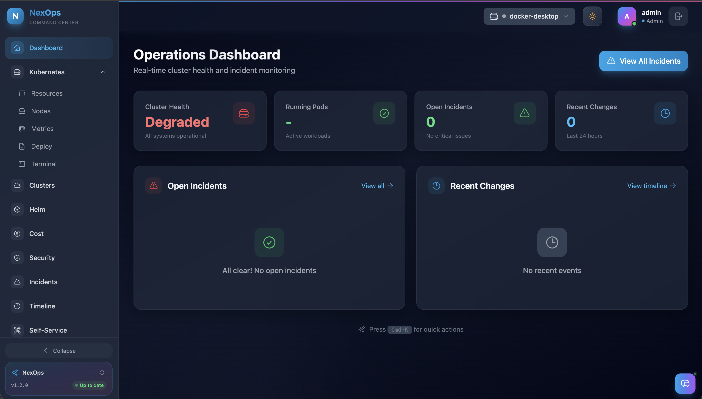
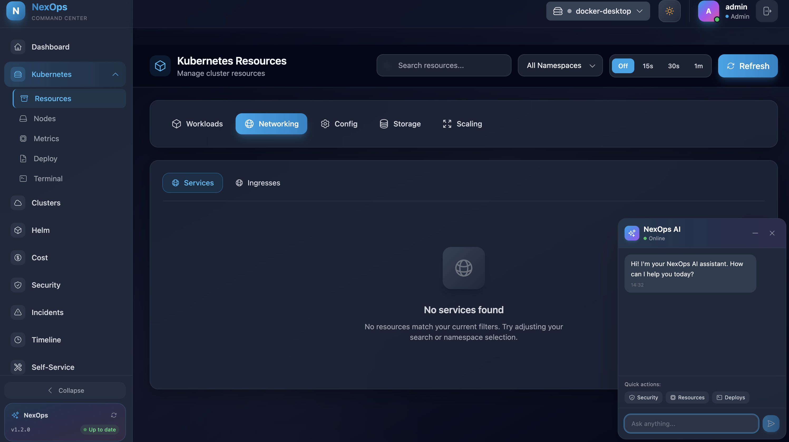

<div align="center">

# NexOps

### DevOps Operations Center

[](https://github.com/gauravtayade11/nexops/actions/workflows/ci.yml)
[](https://github.com/gauravtayade11/nexops/actions/workflows/security.yml)
[](https://github.com/gauravtayade11/nexops/security/code-scanning)
[](https://opensource.org/licenses/MIT)
[](https://github.com/gauravtayade11/nexops/releases)
[](https://github.com/gauravtayade11/nexops/stargazers)
[](https://github.com/gauravtayade11/nexops/network/members)

[](https://www.python.org/)
[](https://www.typescriptlang.org/)
[](https://fastapi.tiangolo.com/)
[](https://reactjs.org/)
[](https://www.docker.com/)
[](https://kubernetes.io/)
[](https://helm.sh/)
[](https://github.com/gauravtayade11/nexops/pulls)

**A modern, comprehensive Kubernetes management dashboard for DevOps teams.**

[Features](#features) • [Screenshots](#screenshots) • [Quick Start](#quick-start) • [Documentation](#documentation) • [Helm](#helm-installation) • [Contributing](#contributing)

---

</div>

## Screenshots

<div align="center">

### Dashboard Overview


### Kubernetes Resources


### Security Posture Dashboard


</div>

## Overview

NexOps is a powerful DevOps Operations Center that provides real-time visibility and control over your Kubernetes clusters. Built with FastAPI and React, it offers an intuitive web interface for monitoring, managing, and troubleshooting your containerized applications.

## Features

### Dashboard & Monitoring
- **Real-time Cluster Health** - Live overview of pods, nodes, and namespace statistics
- **Resource Metrics** - CPU and memory utilization across nodes and pods
- **Event Timeline** - Track cluster events and anomalies
- **Dark Mode Support** - Full dark/light theme with system preference detection

### Workload Management
- **Pods** - View status, logs, and execute commands
- **Deployments** - Scale, restart, and rollback with one click
- **StatefulSets & DaemonSets** - Manage stateful and node-level workloads
- **Jobs & CronJobs** - Monitor batch processing

### Configuration & Storage
- **ConfigMaps & Secrets** - Secure configuration management
- **Persistent Volumes** - Storage provisioning and claims
- **Services & Ingresses** - Network routing and load balancing
- **HPAs** - Autoscaling policies

### Interactive Terminals
- **kubectl Terminal** - Execute kubectl commands directly in the browser
- **Shell Terminal** - Full bash access with kubectl and helm pre-installed
- **Terminal State Persistence** - Command history and output preserved across navigation
- **Pod Exec** - Interactive PTY-based terminal sessions inside containers
  - Full xterm.js terminal with resize support
  - WebSocket-based real-time communication
- **Debug Containers** - Debug distroless/minimal containers without a shell
  - Ephemeral container support via kubectl debug
  - Multiple debug images (busybox, alpine, netshoot)
- **Log Viewer** - Real-time streaming with WebSocket support, search filters, and download
- **Pod Events** - View Kubernetes events for pending/failed pods directly in log viewer

### DevOps Features
- **YAML Deploy** - Apply manifests with dry-run validation
- **Helm Chart UI** - Deploy, upgrade, and rollback Helm releases visually
- **AI Analysis** - Intelligent incident insights (Gemini/Claude)
- **GitFlow Integration** - Branch and release management

### Multi-Cluster & Security
- **Multi-Cluster Support** - Manage multiple Kubernetes clusters from one dashboard
  - Cluster switcher for quick context switching
  - **Cluster Management UI** - Add, remove, and configure clusters
  - View cluster status, metrics, and health
  - Discover clusters from kubeconfig contexts
- **RBAC Integration** - Role-based access control for user permissions
  - JWT-based authentication with 4 user roles (Admin, Developer, Operator, Viewer)
  - Protected routes and API endpoints
  - User management (admin only)
  - Default test users: admin/admin123, developer/developer123, operator/operator123, viewer/viewer123

### Cost Management
- **Cost Analysis Dashboard** - Monitor and optimize cluster costs
  - Resource cost estimation per namespace and pod
  - CPU and memory cost breakdown
  - 30-day cost trend visualization
  - Optimization recommendations
  - Resource efficiency metrics
  - Top cost consumers identification

### Security Posture Dashboard
- **Security Score & Grade** - Overall cluster security assessment (A-F grading)
- **Security Findings** - Real-time detection of misconfigurations
  - Privileged containers detection
  - Root user containers
  - Host path mounts
  - Missing security contexts
- **RBAC Analysis** - Role-based access control security assessment
  - Service account risk analysis
  - Cluster-admin binding detection
  - Wildcard permission identification
- **Network Policy Coverage** - Network security posture
  - Namespace protection status
  - Pod coverage percentage
- **Image Vulnerability Scanning** - Container security with Trivy
  - CVE detection with severity levels
  - CVSS scores and fix versions
- **AI-Powered Remediation** - Google Gemini integration
  - Detailed risk assessments
  - Step-by-step remediation commands
  - YAML configuration examples
  - Best practices and prevention tips

## Quick Start

### Using Docker Compose (Recommended)

```bash
# Clone the repository
git clone https://github.com/gauravtayade11/nexops.git
cd NexOps

# Start the application
make dev
# or
docker-compose up -d

# View logs
make logs
```

Access at **http://localhost:3000**

### Using Makefile

```bash
make help          # Show all available commands
make dev           # Start development environment
make build         # Build Docker images
make logs          # View container logs
make down          # Stop containers
```

## Documentation

### Prerequisites

| Requirement | Version |
|-------------|---------|
| Docker | 20.10+ |
| Docker Compose | 2.0+ |
| kubectl | 1.25+ |
| Kubernetes Cluster | 1.24+ |

### Configuration

Create a `.env` file in the backend directory:

```env
# Application
APP_NAME=NexOps Center
DEBUG=false

# Kubernetes (for local development)
K8S_CONFIG_PATH=~/.kube/config
K8S_IN_CLUSTER=false

# AI Provider (optional)
AI_PROVIDER=gemini
GEMINI_API_KEY=your-api-key
```

### Project Structure

```
NexOps/
├── backend/                 # FastAPI Backend
│   ├── app/
│   │   ├── api/routes/     # REST API endpoints
│   │   ├── core/           # Configuration & settings
│   │   ├── schemas/        # Pydantic models
│   │   └── services/       # Business logic
│   ├── Dockerfile
│   ├── entrypoint.sh
│   └── requirements.txt
├── frontend/               # React Frontend
│   ├── src/
│   │   ├── components/     # React components
│   │   ├── services/       # API client
│   │   └── types/          # TypeScript types
│   ├── Dockerfile
│   └── nginx.conf
├── k8s/                    # Kubernetes Manifests
│   ├── namespace.yaml
│   ├── rbac.yaml
│   ├── deployment.yaml
│   ├── service.yaml
│   └── ingress.yaml
├── docker-compose.yml
├── Makefile
└── README.md
```

### API Reference

#### Cluster Resources
| Endpoint | Method | Description |
|----------|--------|-------------|
| `/api/v1/kubernetes/health` | GET | Cluster health status |
| `/api/v1/kubernetes/namespaces` | GET | List all namespaces |
| `/api/v1/kubernetes/pods` | GET | List all pods |
| `/api/v1/kubernetes/deployments` | GET | List deployments |
| `/api/v1/kubernetes/services` | GET | List services |
| `/api/v1/kubernetes/nodes` | GET | List nodes with details |
| `/api/v1/kubernetes/metrics` | GET | Cluster metrics |

#### Operations
| Endpoint | Method | Description |
|----------|--------|-------------|
| `/api/v1/kubernetes/scale` | POST | Scale deployment replicas |
| `/api/v1/kubernetes/restart` | POST | Rolling restart deployment |
| `/api/v1/kubernetes/apply` | POST | Apply YAML manifest |
| `/api/v1/kubernetes/kubectl` | POST | Execute kubectl command |
| `/api/v1/kubernetes/shell` | POST | Execute shell command |

#### Pod Operations
| Endpoint | Method | Description |
|----------|--------|-------------|
| `/api/v1/kubernetes/pods/{ns}/{pod}/logs` | GET | Stream pod logs |
| `/api/v1/kubernetes/pods/{ns}/{pod}/events` | GET | Get pod events |
| `/api/v1/kubernetes/pods/{ns}/{pod}/exec` | POST | Execute in container |

#### WebSocket Endpoints
| Endpoint | Protocol | Description |
|----------|----------|-------------|
| `/api/v1/ws/pods/{ns}/{pod}/logs` | WS | Real-time log streaming |
| `/api/v1/ws/pods/{ns}/{pod}/exec` | WS | Interactive terminal session |
| `/api/v1/ws/pods/{ns}/{pod}/debug` | WS | Debug container session |

### Kubernetes Deployment

```bash
# Build images
make build-prod

# Deploy to cluster
make k8s-deploy

# Check status
make k8s-status

# Port forward for access
kubectl port-forward -n nexops svc/nexops-frontend 3000:80
```

### Helm Installation

Deploy NexOps to your Kubernetes cluster using Helm:

```bash
# Add the repository (when published)
# helm repo add nexops https://gauravtayade11.github.io/nexops/charts

# Install from local chart
helm install nexops ./charts/nexops -n nexops --create-namespace

# Install with custom values
helm install nexops ./charts/nexops -n nexops --create-namespace \
  --set ingress.enabled=true \
  --set ingress.hosts[0].host=nexops.example.com

# Upgrade existing installation
helm upgrade nexops ./charts/nexops -n nexops

# Uninstall
helm uninstall nexops -n nexops
```

**Configuration options:**

| Parameter | Description | Default |
|-----------|-------------|---------|
| `backend.replicaCount` | Backend replicas | `1` |
| `frontend.replicaCount` | Frontend replicas | `1` |
| `ingress.enabled` | Enable ingress | `false` |
| `ingress.hosts[0].host` | Ingress hostname | `nexops.local` |
| `backend.extraEnv` | Extra env vars (secrets) | `[]` |

See [charts/nexops/values.yaml](charts/nexops/values.yaml) for all options.

## Security

### Application Security
- **Shell Protection** - Dangerous commands are blocked (rm -rf /, sudo, etc.)
- **kubectl Guard** - Destructive operations require confirmation
- **Secret Masking** - Only key names displayed, not values
- **RBAC Ready** - Granular Kubernetes permissions

### CI/CD Security Scanning
- **CodeQL Analysis** - Static code analysis for JavaScript and Python
- **Trivy Docker Scan** - Container vulnerability scanning for CRITICAL/HIGH CVEs
- **Dependency Review** - License compliance and vulnerability checks on PRs
- **Secret Detection** - Gitleaks integration for credential leak prevention
- **OSSF Scorecard** - Open Source Security Foundation best practices

## Tech Stack

| Layer | Technology |
|-------|------------|
| Backend | FastAPI, Python 3.11, kubernetes-client |
| Frontend | React 18, TypeScript, Vite, Tailwind CSS |
| Container | Docker, nginx |
| Orchestration | Kubernetes, Helm |
| CLI Tools | kubectl, helm |

## Contributing

We welcome contributions! Please see [CONTRIBUTING.md](CONTRIBUTING.md) for guidelines.

```bash
# Development setup
git clone https://github.com/gauravtayade11/nexops.git
cd NexOps
make dev
```

## Changelog

See [CHANGELOG.md](CHANGELOG.md) for detailed version history and release notes.

---

## License

This project is licensed under the MIT License - see the [LICENSE](LICENSE) file for details.

---

<div align="center">

**Built with passion for DevOps teams**

[Report Bug](../../issues) • [Request Feature](../../issues)

</div>
