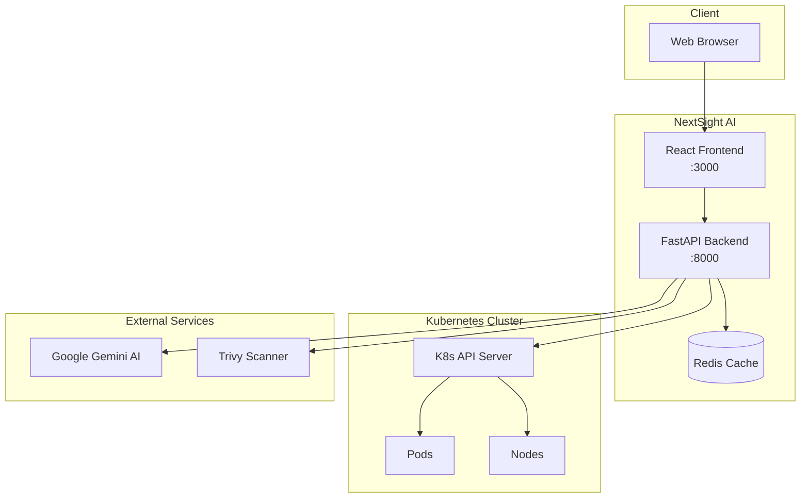

# Deployment Guide

Choose the deployment method that best fits your environment and requirements.

### :material-docker: Docker Compose
Quickest way to get started. Perfect for development and testing.

[:octicons-arrow-right-24: Docker Compose](docker-compose.md)

### :material-kubernetes: Kubernetes
Production-ready deployment using native Kubernetes manifests.

[:octicons-arrow-right-24: Kubernetes](kubernetes.md)

### :material-ship-wheel: Helm Chart
Customizable deployment with Helm for advanced configurations.

[:octicons-arrow-right-24: Helm Chart](helm.md)

## Deployment Comparison

| Feature | Docker Compose | Kubernetes | Helm |
|---------|---------------|------------|------|
| Setup Time | ~2 min | ~10 min | ~5 min |
| Customization | Limited | High | Very High |
| Scaling | Manual | Auto (HPA) | Auto (HPA) |
| Best For | Development | Production | Production |
| Updates | Manual | Rolling | Rolling |

## Architecture Overview

## Resource Requirements

### Minimum Requirements

| Component | CPU | Memory | Storage |
|-----------|-----|--------|---------|
| Backend | 0.5 cores | 512 MB | - |
| Frontend | 0.25 cores | 256 MB | - |
| Redis | 0.25 cores | 128 MB | 1 GB |

### Recommended for Production

| Component | CPU | Memory | Storage |
|-----------|-----|--------|---------|
| Backend | 2 cores | 2 GB | - |
| Frontend | 1 core | 512 MB | - |
| Redis | 1 core | 1 GB | 10 GB |

## Security Considerations

!!! warning "Production Checklist"

    - [ ] Enable TLS/SSL for all connections
    - [ ] Configure proper RBAC permissions
    - [ ] Use secrets management for API keys
    - [ ] Set up network policies
    - [ ] Enable audit logging
    - [ ] Configure resource limits
