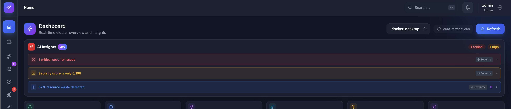

# Dashboard

The NextSight AI dashboard provides a comprehensive view of your Kubernetes cluster health and resources.

## Overview

### Real-Time Cluster Monitoring

*Complete cluster overview showing pod status, resource utilization, and actionable AI recommendations in a unified dashboard*

## Key Metrics

### Cluster Health
- **Total Pods** - Count of all pods across namespaces
- **Running Pods** - Pods in Running state
- **Pending Pods** - Pods waiting to be scheduled
- **Failed Pods** - Pods in Failed or CrashLoopBackOff state

### Resource Utilization
- **CPU Usage** - Cluster-wide CPU utilization
- **Memory Usage** - Cluster-wide memory utilization
- **Node Status** - Ready/NotReady node counts

### Recent Activity
- **Events Timeline** - Latest Kubernetes events
- **Deployments** - Recent deployment activities
- **Alerts** - Active warnings and errors

## AI-Powered Insights

### Actionable Insights Card

*AI automatically analyzes cluster health and provides proactive recommendations with one-click actions*

## Widgets

### Namespace Overview
Shows resource distribution across namespaces:
- Pod count per namespace
- Resource requests/limits
- Health status

### Node Status
Displays node health:
- CPU/Memory capacity and usage
- Pod capacity
- Conditions (Ready, DiskPressure, MemoryPressure)

### Top Consumers
Lists resources with highest utilization:
- Top 5 pods by CPU
- Top 5 pods by memory
- Resource efficiency scores

## Dark Mode

Toggle between light and dark themes:
- Click the theme toggle in the header
- System preference auto-detection
- Persistent preference storage

## Refresh & Auto-Update

- **Manual Refresh** - Click refresh button for immediate update
- **Auto-Refresh** - Data updates every 30 seconds
- **WebSocket** - Real-time updates for critical metrics
