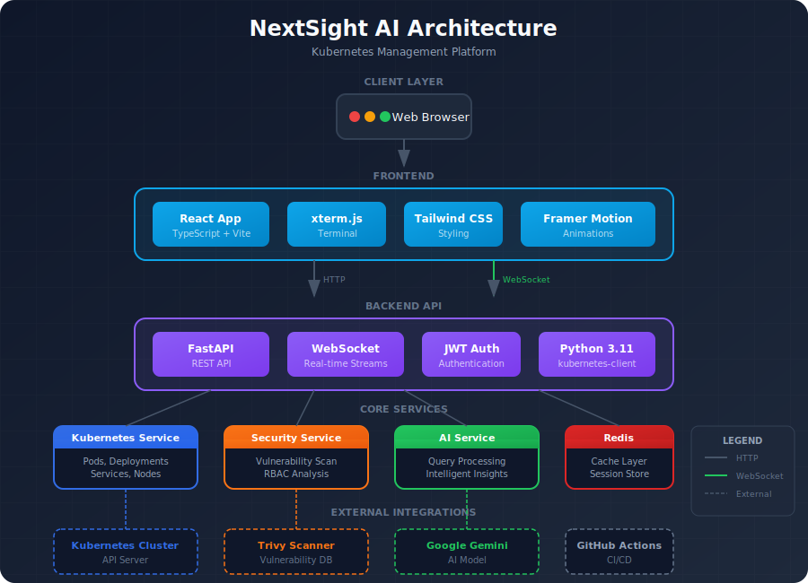
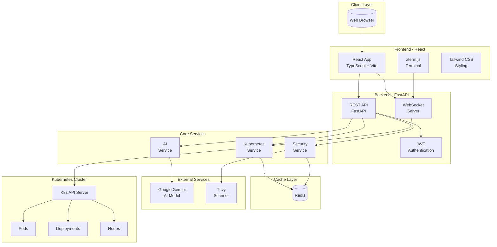
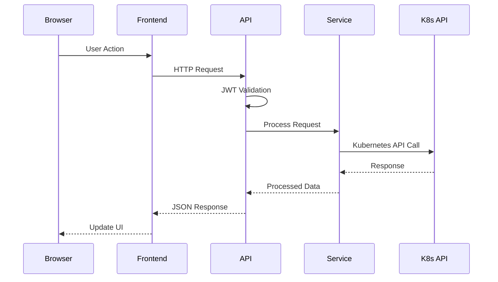
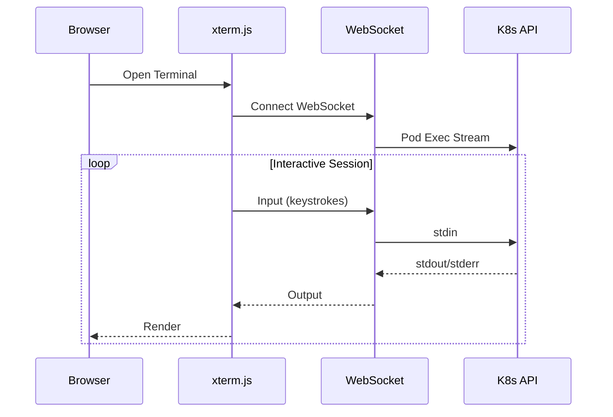
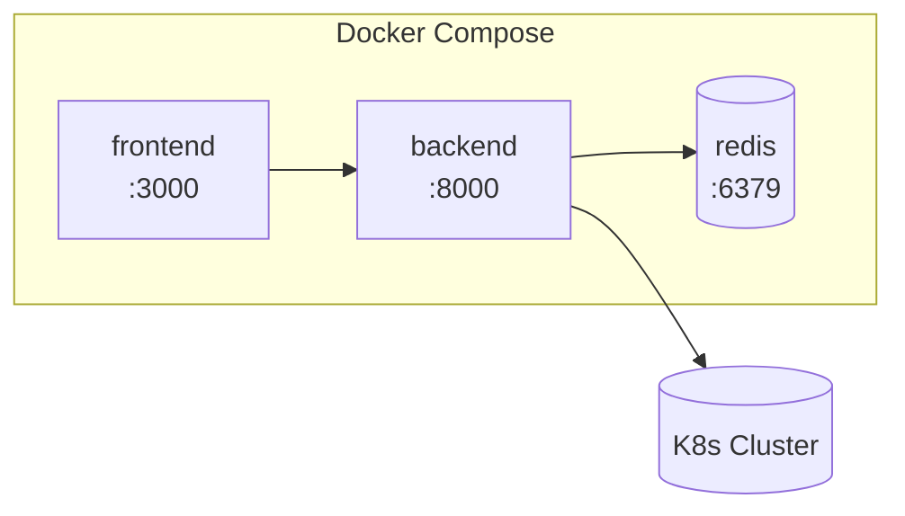
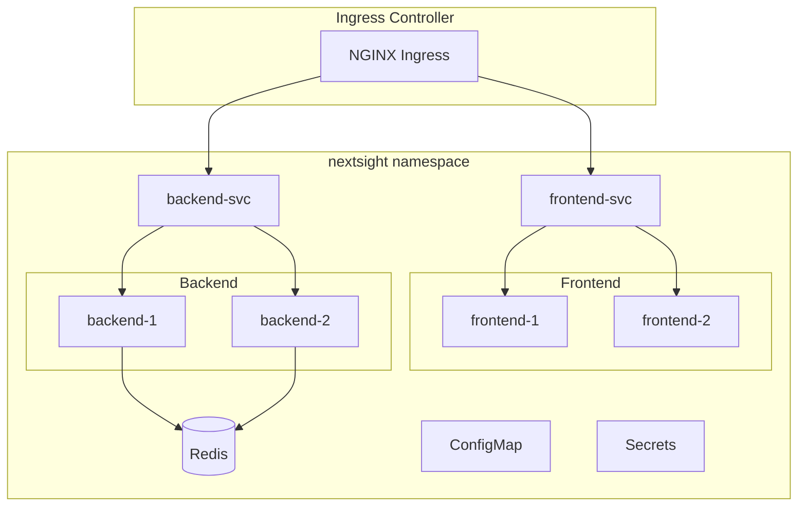
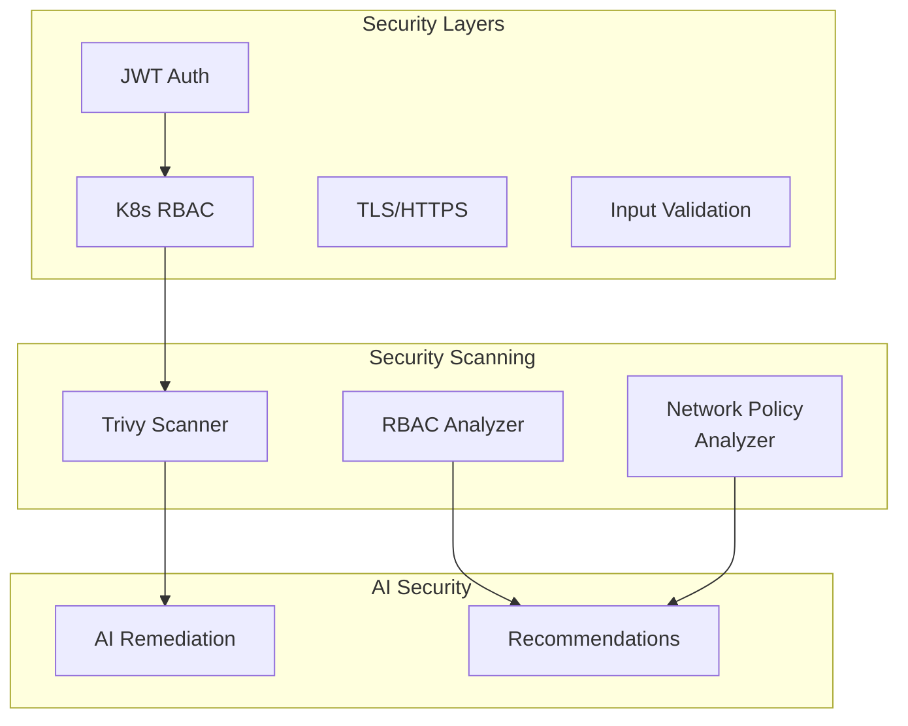

# Architecture

NextSight AI follows a modern microservices architecture designed for scalability and reliability.

## System Overview

## Component Details

### Frontend

| Component | Technology | Purpose |
|-----------|------------|---------|
| **React App** | React 18, TypeScript | User interface |
| **Vite** | Build tool | Fast development & builds |
| **Tailwind CSS** | Styling | Glass-morphism design |
| **xterm.js** | Terminal emulator | Pod exec & logs |
| **Framer Motion** | Animations | Smooth transitions |

### Backend

| Component | Technology | Purpose |
|-----------|------------|---------|
| **FastAPI** | Python 3.11 | REST API framework |
| **WebSockets** | asyncio | Real-time streaming |
| **kubernetes-client** | Python SDK | Cluster communication |
| **JWT** | PyJWT | Authentication |

### Services

| Service | Responsibility |
|---------|----------------|
| **Kubernetes Service** | Pod, deployment, service, node operations |
| **Security Service** | Vulnerability scanning, RBAC analysis |
| **AI Service** | Gemini integration, query processing |

## Data Flow

### API Request Flow

### WebSocket Flow (Terminal/Logs)

## Deployment Architecture

### Docker Compose

### Kubernetes Deployment

## Security Architecture

## Technology Stack Summary

### Languages & Frameworks

- **Python 3.11** - Backend services
- **TypeScript** - Frontend application
- **React 18** - UI components
- **FastAPI** - REST API

### Infrastructure

- **Docker** - Containerization
- **Kubernetes** - Orchestration
- **Helm** - Package management
- **Redis** - Caching

### External Integrations

- **Google Gemini** - AI assistant
- **Trivy** - Vulnerability scanning
- **GitHub Actions** - CI/CD

## Scalability Considerations

| Component | Scaling Strategy |
|-----------|-----------------|
| Frontend | Horizontal (replicas) |
| Backend | Horizontal (replicas) |
| Redis | Single instance / Sentinel |
| API Calls | Rate limiting |
| WebSockets | Sticky sessions |
